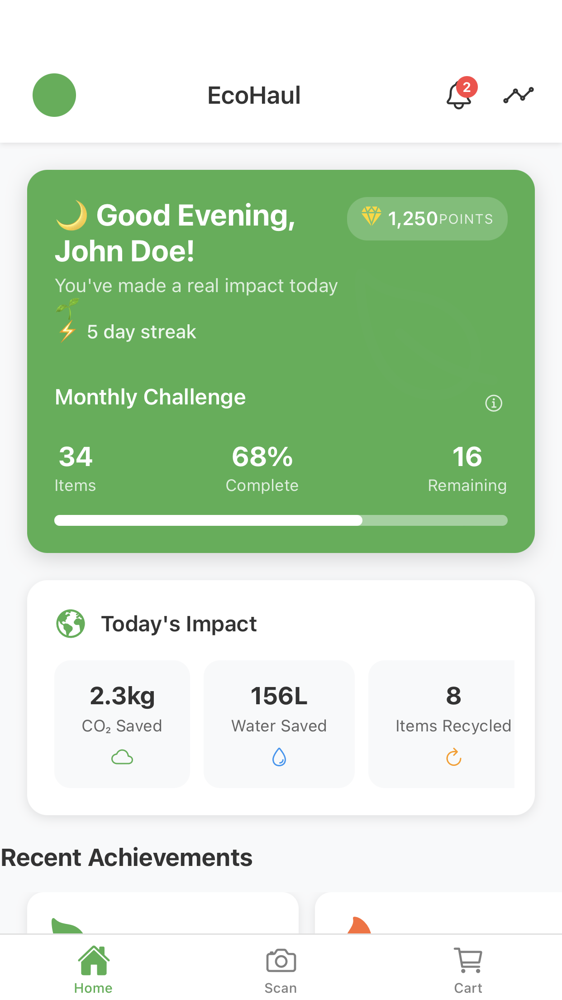
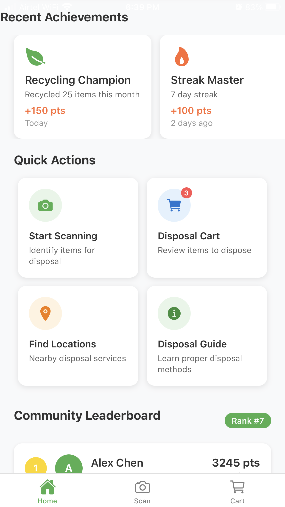
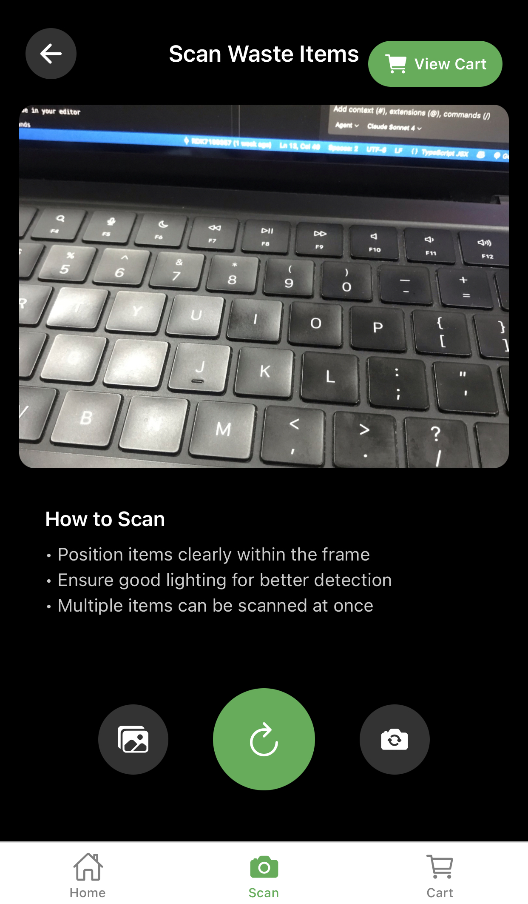

# EcoHaul - Smart Waste Management Mobile App

<p align="center">
  
</p>

<p align="center">
  <strong>Revolutionizing waste management through gamification and intelligent disposal solutions</strong>
</p>

<p align="center">
  Built with React Native • Expo • TypeScript • Redux Toolkit
</p>

---

## 📱 App Screenshots

### 🏠 Home Screen
<div align="center">
  
**Part 1 - Dashboard Overview**
<p>
  
</p>
*Gamified dashboard with points, leaderboards, and monthly goals*

**Part 2 - Quick Actions & Stats**
<p>
  
</p>
*Environmental impact stats and quick navigation*

</div>

### 📷 Scanning Experience
<div align="center">
  
**Smart Item Detection**
<p>
  
</p>
*Real-time camera-based waste item detection and classification*

</div>

### 🛒 Cart Management
<div align="center">
  
**Item Review & Management**
<p>
  
</p>
*Review, edit, and manage scanned items before disposal*

</div>

---

## 🌟 Key Features

### 🎯 Core Functionality
- **🔐 User Authentication**: Secure email/password authentication with persistent sessions
- **🎮 Gamified Dashboard**: Personal point tracking, monthly goals, community leaderboards
- **📱 Intelligent Scanning**: Real-time camera-based waste item detection and classification
- **🛒 Dynamic Cart Management**: Review, edit, and manage scanned items before disposal
- **🗺️ AI-Powered Disposal Agent**: Location-based recycling center recommendations
- **📖 LLM-Generated Guides**: Step-by-step disposal instructions with safety warnings

### 📊 Gamification System
| Item Type | Points | Environmental Impact |
|-----------|--------|---------------------|
| 🥤 Plastic | 10 pts | High recycling value |
| 🥫 Metal | 15 pts | Infinite recyclability |
| 🍶 Glass | 12 pts | 100% recyclable |
| 📱 Electronic | 25 pts | Precious metal recovery |
| ⚠️ Hazardous | 30 pts | Safe disposal critical |

## 🛠 Technical Stack

<div align="center">

| Frontend | State Management | Navigation | Camera/Location |
|----------|------------------|------------|-----------------|
| React Native | Redux Toolkit | React Navigation 7 | Expo Camera |
| Expo SDK 51 | React Redux | Stack Navigator | Expo Location |
| TypeScript | Persistent Storage | Tab Navigator | Expo Image Picker |

</div>

### 📦 Key Dependencies
```json
{
  "@reduxjs/toolkit": "^2.8.2",
  "@react-navigation/native": "^7.1.6",
  "expo-camera": "^16.1.11",
  "expo-location": "^18.1.6",
  "expo-secure-store": "~14.2.4",
  "react-native-paper": "^5.14.5"
}
```

## � Quick Start

### Prerequisites
- Node.js (v18+) 
- Expo CLI
- iOS Simulator / Android Studio

### Installation

```bash
# Clone the repository
git clone https://github.com/RDK7159357/ECO_HAUL.git
cd EcoHaul

# Install dependencies
npm install

# Start development server
npm start

# Run on specific platform
npm run ios     # iOS Simulator
npm run android # Android Emulator
npm run web     # Web Browser
```

## 📁 Project Architecture

```
EcoHaul/
├── 📱 src/
│   ├── 🗄️ store/
│   │   ├── slices/
│   │   │   ├── authSlice.ts      # 🔐 Authentication
│   │   │   ├── cartSlice.ts      # 🛒 Cart management
│   │   │   ├── disposalSlice.ts  # 🗺️ Disposal centers
│   │   │   └── userSlice.ts      # 👤 User stats
│   │   └── store.ts              # ⚙️ Redux configuration
│   ├── 📺 screens/
│   │   ├── AuthScreen.tsx        # 🔑 Login/Register
│   │   ├── DashboardScreen.tsx   # 🏠 Main dashboard
│   │   ├── ScannerScreen.tsx     # 📷 Camera scanning
│   │   ├── CartScreen.tsx        # 🛒 Item management
│   │   └── ...                   # 🔗 Other screens
│   └── 🧩 components/            # ♻️ Reusable components
├── 🎨 assets/                    # 🖼️ Images & icons
└── 📋 App.tsx                    # 🎯 Root component
```

## 🎯 User Journey & Features

### 1. 🔐 Authentication Flow
- **Sign Up**: New users register with name, email, and secure password
- **Sign In**: Returning users access with email/password
- **Session Management**: Automatic login with secure credential storage

### 2. 🏠 Dashboard Experience
- **📊 Stats Overview**: Current points, ranking, and monthly progress
- **🏆 Leaderboards**: Community rankings and achievements
- **🎯 Goals Tracking**: Monthly sustainability targets with visual progress
- **🌍 Impact Stats**: CO₂ saved, trees equivalent, water conserved

### 3. 📷 Smart Scanning Process
- **Camera Interface**: Intuitive scanning overlay with real-time detection
- **Multi-Item Detection**: Scan multiple waste items simultaneously  
- **Gallery Import**: Upload existing photos for analysis
- **Confidence Scores**: AI confidence ratings for each detection

### 4. 🛒 Intelligent Cart Management
- **Item Review**: View all detected items with categories and confidence
- **Manual Editing**: Correct categories or remove incorrect detections
- **Points Preview**: Calculate potential points before disposal
- **Batch Operations**: Manage multiple items efficiently

### 5. 🗺️ Disposal Solutions
- **🏢 Find Centers**: Location-based recycling facility recommendations
- **📖 Get Guides**: AI-generated step-by-step disposal instructions
- **✅ Complete Disposal**: Earn points and update environmental impact

## 🎮 Achievement System

### 🏅 User Levels
```
🌱 Eco Novice      →  0-100 points    →  Getting started
🌿 Green Explorer  →  101-500 points  →  Building habits  
⚔️ Eco Warrior     →  501-1000 points →  Advanced recycler
🏆 Sustainability Champion → 1000+ points → Environmental leader
```

### 🎯 Monthly Challenges
- **Streak Goals**: Consecutive days of disposal activity
- **Category Challenges**: Diversify recycling across waste types
- **Community Goals**: Collaborative environmental targets
- **Impact Milestones**: Personal environmental footprint reduction

## 🌍 Environmental Impact Tracking

<div align="center">

| Metric | Calculation | Visualization |
|--------|-------------|---------------|
| 🌲 Trees Saved | Items × 0.8 | Tree counter |
| 💨 CO₂ Reduced | Weight-based formula | Carbon footprint |
| 💧 Water Saved | Category-specific values | Water droplets |
| 📏 Landfill Diverted | Items × 0.15m² | Space visualization |

</div>

## ⚙️ Configuration & Setup

### 🔧 Environment Variables
Create a `.env` file in the project root:
```env
EXPO_PUBLIC_API_URL=your_backend_api_url
EXPO_PUBLIC_AI_DETECTION_KEY=your_ai_service_key
EXPO_PUBLIC_LLM_API_KEY=your_llm_api_key
```

### 📱 Required Permissions
| Permission | Purpose | Platform |
|------------|---------|----------|
| 📷 Camera | Waste item scanning | iOS/Android |
| 📍 Location | Find nearby disposal centers | iOS/Android |
| 💾 Storage | Cache user data and images | iOS/Android |

## 🚧 Development Roadmap

### ✅ Phase 1: MVP (Completed)
- [x] 🔐 User authentication system
- [x] 🎮 Gamified dashboard with points & leaderboards
- [x] 📷 Camera scanning interface with overlay
- [x] 🛒 Comprehensive cart management
- [x] 🎯 Mock AI detection service

### 🔄 Phase 2: Enhanced Features (In Progress)
- [ ] 🔌 Backend API integration
- [ ] 🤖 Real AI object detection model
- [ ] 🗺️ Live location-based center search
- [ ] 📲 Push notifications & reminders

### 📋 Phase 3: Advanced Features (Planned)
- [ ] 🧠 LLM integration for disposal guides
- [ ] 👥 Social features and community challenges
- [ ] ⚡ Offline mode support
- [ ] 📊 Advanced analytics dashboard

## 🔒 Security & Privacy

### 🛡️ Data Protection
- **🔐 Secure Storage**: Credentials encrypted with Expo SecureStore
- **🔄 Session Management**: Automatic token refresh and secure logout
- **✅ Input Validation**: Comprehensive form validation and sanitization
- **📱 Permission Handling**: Graceful permission request flows

### 🌐 Privacy First
- **📍 Location**: Only used for finding nearby centers
- **📷 Camera**: Images processed locally, not stored remotely
- **👤 Personal Data**: Minimal data collection, user-controlled sharing

## 🐛 Known Issues & Limitations

### ⚠️ Current Limitations
- **🤖 Mock AI**: Using simulated object detection (real AI in development)
- **💾 Local Storage**: No cloud sync yet (backend integration planned)
- **📦 Fixed Categories**: Limited waste type classifications
- **🌐 Platform Support**: Web version has basic functionality

### 🔧 Planned Improvements
- Real-time AI model integration with TensorFlow Lite
- Cloud synchronization with offline-first approach
- Expanded waste categories with custom training
- Enhanced web experience with PWA features

## 🤝 Contributing

### 👥 How to Contribute
We welcome contributions! Here's how you can help make EcoHaul better:

1. **🍴 Fork the Repository**
   ```bash
   git fork https://github.com/RDK7159357/ECO_HAUL.git
   ```

2. **🌿 Create a Feature Branch**
   ```bash
   git checkout -b feature/amazing-new-feature
   ```

3. **💾 Commit Your Changes**
   ```bash
   git commit -m "✨ Add amazing new feature"
   ```

4. **📤 Push to Branch**
   ```bash
   git push origin feature/amazing-new-feature
   ```

5. **🔄 Open a Pull Request**

### 📝 Development Guidelines
- **TypeScript**: Use TypeScript for type safety
- **Code Style**: Follow React Native and Expo best practices  
- **Comments**: Document complex logic and algorithms
- **Testing**: Add tests for new features
- **Commits**: Use conventional commit messages with emojis

### 🎯 Areas for Contribution
- **🤖 AI Integration**: Implement real object detection models
- **🌍 Localization**: Add multi-language support
- **♿ Accessibility**: Improve app accessibility features
- **📊 Analytics**: Enhanced user analytics and insights
- **🎨 UI/UX**: Design improvements and animations

## 📄 License

This project is licensed under the **MIT License** - see the [LICENSE](LICENSE) file for full details.

```
MIT License - Feel free to use, modify, and distribute
Educational and commercial use permitted
Attribution required
```

## 🙏 Acknowledgments

<div align="center">

**Special Thanks To:**

🚀 [**Expo Team**](https://expo.dev) - Exceptional development platform  
⚛️ [**React Native Community**](https://reactnative.dev) - Comprehensive ecosystem  
🗄️ [**Redux Toolkit**](https://redux-toolkit.js.org) - Simplified state management  
🌍 **Environmental Organizations** - Waste management guidance  

</div>

## 📞 Support & Contact

<div align="center">

**Need Help? Get in Touch!**

📧 **Email**: [support@ecohaul.com](mailto:support@ecohaul.com)  
🐛 **Issues**: [Create an Issue](https://github.com/RDK7159357/ECO_HAUL/issues)  
💬 **Discussions**: [Join the Discussion](https://github.com/RDK7159357/ECO_HAUL/discussions)  

</div>

---

<div align="center">

**🌱 EcoHaul - Making Waste Management Smart, Engaging, and Rewarding! ♻️**

*"Every small action creates a big environmental impact"*

**⭐ Star this repo if you found it helpful!**

[](https://github.com/RDK7159357/ECO_HAUL/stargazers)
[](https://github.com/RDK7159357/ECO_HAUL/network/members)

</div>